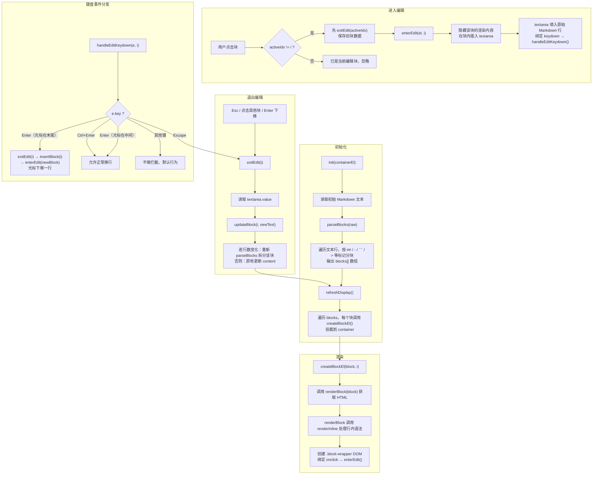
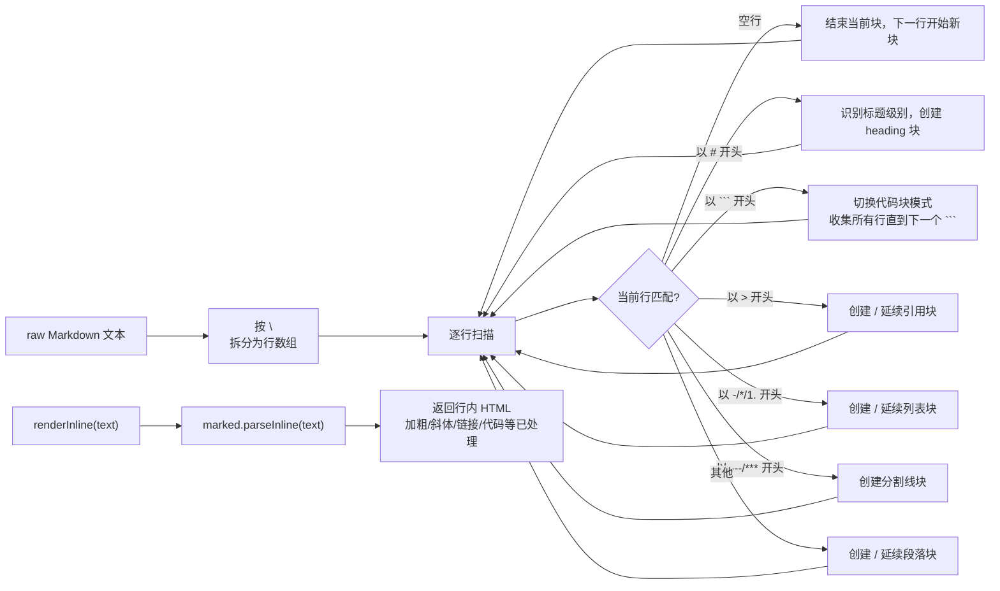

<!--
  MarkEdit v1.0 — 设计规格说明书 (Design Specification)
  Created: 2026-06-26
  Target: 单文件 HTML Markdown 编辑器，Typora 块级源显模式
  Parsing: 内联 marked.js (约 15KB，零网络依赖)
-->

# MarkEdit v1.0 — 设计规格书

## 1. 项目概述

**定位**：单文件 HTML Markdown 编辑器，所有资源内联于一个 `.html` 文件。

**核心体验**：Typora 风格的块级源显模式。整页只有一个编辑区，文档以渲染态展示；点击任意块进入编辑态（显示 Markdown 源码 textarea），失焦 / Esc 退出编辑态并重渲染。

**v1.0 范围**：仅实现编辑/预览一体化，不含文件保存、工具栏、导出。

**Markdown 解析方案**：方案 C — 将 `marked.js` 完整内联到 HTML 中（`<script>` 标签内），零网络依赖，享受成熟的 GFM 语法支持。

## 2. 整体架构

### 2.1 核心思想

文档 = 块序列。每个块在同一时刻要么处于**渲染态**，要么处于**编辑态**。

- **数据源**：`blocks: Array<{type, content, lines}>` —— 全局状态唯一真实来源
- **编辑状态**：`activeIdx: number | null` —— 同一时刻最多一个块处于编辑态
- **块类型（BlockType）**：`heading` | `paragraph` | `list` | `codeblock` | `quote` | `divider` | `empty`

### 2.2 数据结构

```
Block {
  type: BlockType       // 块类型
  content: string       // 该块的原始 Markdown 文本（多行）
  lines: string[]       // content 按 \n 拆分后的行数组
}
```

### 2.3 全局变量

| 变量 | 类型 | 说明 |
|------|------|------|
| `blocks` | `Block[]` | 文档块数组，系统唯一真实数据源 |
| `activeIdx` | `number \| null` | 当前编辑中的块索引；无编辑时 null |
| `container` | `HTMLElement` | 编辑器根 DOM 容器元素 |

### 2.4 数据流

```
用户点击块 → 定位块索引 → enterEdit() → [textarea 显示源码]
编辑中 Esc/失焦    → exitEdit() → updateBlock() → rebuildDoc() → refreshDisplay()
编辑中 Enter(末尾) → exitEdit() → insertBlock() → enterEdit(新块) → refreshDisplay()
```

## 3. 函数目录

共 14 个核心函数，按职责分为 4 层：

### 3.1 解析层（Markdown ↔ Blocks）

**1. `parseBlocks(raw: string): Block[]`**
将原始 Markdown 文本解析为块数组。逐行扫描，按行首标记（`#`、`-`、`>`、`\`\`\``、空行等）识别块类型并分组。

**2. `renderInline(text: string): string`**
将单行文本中的行内 Markdown 转为 HTML。直接调用 `marked.parseInline(text)`，处理加粗、斜体、链接、行内代码、图片等。

### 3.2 渲染层（Blocks → DOM）

**3. `renderBlock(block: Block): string`**
将单个块渲染为 HTML 字符串。根据 `block.type` 调用不同的 HTML 模板，内部调用 `renderInline()` 处理行内内容。

**4. `renderDoc(blocks: Block[]): string`**
将全部块渲染为完整 HTML 字符串。遍历 `blocks`，每个块调用 `renderBlock()`，拼接外层容器。

**5. `createBlockEl(block: Block, i: number): HTMLElement`**
为块创建 DOM 元素（渲染态），绑定 `onclick` → `enterEdit()`，设置 `data-block-index` 属性。

**6. `refreshDisplay(): void`**
全量重渲染文档 DOM。清空 `container`，遍历 `blocks`，每个块调用 `createBlockEl()` 并挂载。

### 3.3 编辑层（编辑态管理）

**7. `enterEdit(el: HTMLElement, i: number): void`**
将指定块切换为编辑态。若有其他块正在编辑则先退出。隐藏块的渲染内容，在块内插入 textarea 并填入 `blocks[i].content`，设置 `activeIdx = i`，绑定 keydown 事件。

**8. `exitEdit(i: number): void`**
退出编辑态。读取 textarea 内容，调用 `updateBlock()`，设置 `activeIdx = null`，调用 `refreshDisplay()`。

**9. `handleEditKeydown(e: KeyboardEvent, i: number): void`**
编辑态键盘事件分发器：

| 按键 | 行为 |
|------|------|
| `Escape` | `exitEdit(i)` |
| `Enter`（光标在末尾） | `exitEdit(i)` → `insertBlock(i, 'paragraph')` → `enterEdit(newEl, i+1)` |
| `Enter`（光标在中间） | 允许正常换行 |
| `Ctrl+Enter` | 总是允许换行 |
| 其他 | 不做拦截 |

### 3.4 数据层（块操作）

**10. `updateBlock(i: number, text: string): void`**
更新某个块的文本内容。根据 `text` 是否包含 '\n' 决定是否需要重新 `parseBlocks()` 拆分该块。

**11. `rebuildDoc(): string`**
从 `blocks` 数组重建原始 Markdown 文本。遍历所有块，按类型格式化并拼接，用于持久化或导出。

**12. `insertBlock(i: number, type: BlockType): void`**
在 `blocks[i]` 后插入一个空的新块。用于 Enter 分裂块时创建下一行。

**13. `mergeBlocks(i: number, j: number): void`**
合并两个相邻块。将 `blocks[j]` 的内容拼接到 `blocks[i]` 末尾，删除 `blocks[j]`。

**14. `init(containerEl: HTMLElement): void`**
初始化编辑器入口。读取 `containerEl.textContent` 作为初始 Markdown，调用 `parseBlocks()` → `refreshDisplay()`，将 `containerEl` 转为编辑器。外层 HTML 在 `<body onload="...">` 时调用。

## 4. 系统流程图

### 4.1 整体流程



### 4.2 块解析子流程



## 5. 关键编辑交互规格

### 5.1 进入编辑

1. 用户点击渲染态块 → 触发 `enterEdit(el, i)`
2. 若 `activeIdx !== null && activeIdx !== i`：先 `exitEdit(activeIdx)` 保存前一个块
3. 隐藏该块的渲染 DOM 内容
4. 在块内动态创建 `<textarea>`，填入 `blocks[i].content`
5. `activeIdx = i`
6. textarea 获得焦点，光标移到末尾
7. 绑定 `keydown` 事件 → `handleEditKeydown()`

### 5.2 退出编辑

1. 触发条件：Esc 键 / 点击其他块 / Enter（光标在末尾）
2. 读取 `textarea.value`
3. 调用 `updateBlock(i, text)`：若 text 含 '\n' 则对该块的 lines 重新 `parseBlocks`
4. `activeIdx = null`
5. 调用 `refreshDisplay()` 全量重渲染

### 5.3 Enter 分裂块

1. 光标在 textarea 末尾时按 Enter
2. `exitEdit(i)` 保存当前块
3. `insertBlock(i, 'paragraph')` 在当前位置后插入新空块
4. `enterEdit(newBlockEl, i+1)` 立即进入新块的编辑态

### 5.4 文本更新与行拆分

`updateBlock(i, text)` 处理逻辑：

1. 若 `text` 不含 `'\n'`：直接更新 `blocks[i].content` 和 `blocks[i].lines`
2. 若 `text` 含 `'\n'`：从 `blocks` 中移除第 `i` 块，对 `text.split('\n')` 重新调用 `parseBlocks()`，将新块数组插入原位置

## 6. 实现约束

### 6.1 文件结构

```
markdown-editor-v1.html    （单文件，所有内容内联）
├── <style>                （CSS 样式，约 150 行）
├── <div id="editor">      （编辑器容器，含初始 Markdown 示例文本）
├── <script>               （marked.js 内联，约 15KB，minified）
└── <script>               （编辑器逻辑，约 500 行 JS）
```

### 6.1 CSS 设计要点

- 渲染态：标题、段落、列表、引用、代码块各有独立样式
- 编辑态：textarea 的字体、行高、padding 与渲染态完全一致，避免切换时的视觉跳动
- 字体选择：等宽中文字体（如 `"Source Han Mono SC", "Courier New", monospace`）
- 光标定位在点击的块内，无页面滚动跳动

### 6.2 开放问题（v2+ 迭代）

- 文件打开 / 保存
- 工具栏（加粗、斜体按钮）
- 图片拖拽上传
- 暗色模式
- 导出 HTML / PDF

## 7. 验收标准

- [ ] 输入 Markdown 文本，页面加载后立即显示渲染结果
- [ ] 点击任意块进入编辑态，显示原始 Markdown 源码
- [ ] 块编辑态下 Esc 键退出编辑并重渲染
- [ ] 块编辑态下 Enter（光标在末尾）创建新段落块
- [ ] 块编辑态下 Enter（光标在中间）正常插入换行
- [ ] 点击其他块时自动保存前一个块并切换到新块编辑态
- [ ] 支持 GFM 标准 Markdown 语法（标题、加粗、斜体、删除线、链接、图片、列表、引用、代码块、分割线）
- [ ] 编辑-渲染切换时无视觉跳动

*** End of File
